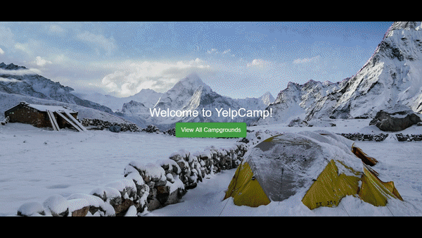

# YelpCamp-2

This was the first full website that I made as part of The Web Developer Bootcamp by Colt Steele. 
It is a user-sourced directory of campsites with user authentication for posting new campsites, making comments, and editing posts. 
The google maps API is used to add a map of the location in the campsite information. 
YelpCamp was built using NodeJS, ExpressJS, MongoDB, mLab, and PassportJS
I built this blog app to learn how to use the react-router library. 
It makes REST API calls to a blog database. Then, once information has been fetched from the database, 
it uses the redux library to manage the blog data so that it is loaded instantaneously. 



## Demo
https://whispering-dusk-48997.herokuapp.com/


### Getting Started

There are two methods for getting started with this repo.

#### Familiar with Git?
Checkout this repo, install dependencies, then start the gulp process with the following:

```
> git clone https://github.com/rdoner/YelpCamp-2.git
> cd YelpCamp-2
> npm install
> npm start
```

#### Not Familiar with Git?
Click [here](https://github.com/rdoner/YelpCamp-2.git) then download the .zip file.  Extract the contents of the zip file, then open your terminal, change to the project directory, and:

```
> npm install
> npm start
```
